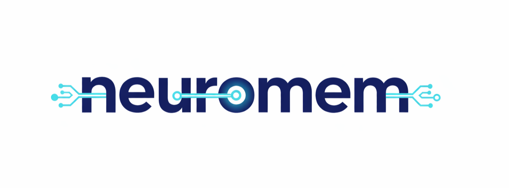

<h3 align="center">
Benchmark suite for NeuroMem memory systems
</h3>

<p align="center">
| <a href="https://github.com/intellistream/NeuroMem"><b>NeuroMem Core</b></a> | <a href="https://github.com/intellistream/SAGE"><b>SAGE</b></a> | <a href="https://intellistream.slack.com/"><b>Developer Slack</b></a> |
</p>

🔥 **neuromem-bench** is the standalone benchmark companion for [NeuroMem](https://github.com/intellistream/NeuroMem). It provides an extensible pipeline architecture to evaluate different memory services under long-dialogue scenarios.

## Owner & Contact

- Repository Owner: [@KimmoZAG](https://github.com/KimmoZAG) (RuiCheng / 张睿诚)
- Maintainer Contact: Please open an issue in this repo and mention `@KimmoZAG`.

---

## Getting Started

```bash
# Clone
git clone https://github.com/intellistream/NeuroMem-Bench.git
cd neuromem-bench

# Install (editable mode)
pip install -e .

# Or use the quickstart script
./quickstart.sh
```

### Run a benchmark

```bash
# 1. Prepare config
cp benchmarks/experiment/config/example.yaml my_config.yaml
# Edit my_config.yaml (LLM API endpoint, dataset, memory service, etc.)

# 2. Run
python -m benchmarks.experiment.memory_test_pipeline --config my_config.yaml --task_id sample-01
```

### Run tests

```bash
# Installation validation (pure Sage demos)
python test/installation_validation/sage_pipeline.py
python test/installation_validation/pipeline_as_service.py

# Benchmark mock test (offline, no external services)
python -m pytest test/benchmark/ -v
```

## Architecture

```
Main Pipeline:      MemorySource → PipelineCaller → MemorySink
                                        │
                 ┌──────────────────────┼──────────────────────┐
                 ▼                                              ▼
Insert Pipeline: PreInsert → MemoryInsert → PostInsert    Test Pipeline: PreRetrieval → MemoryRetrieval → PostRetrieval → MemoryEvaluation
```

The four extensible stages (**PreInsert** / **PostInsert** / **PreRetrieval** / **PostRetrieval**) use a strategy pattern — swap processing operators via config without changing the pipeline.

## Customization

- **Custom Operator** — Subclass the corresponding stage base class and register it in the Registry.
- **Custom Dataset** — Implement the `BaseDataLoader` interface and register it with `DataLoaderFactory`.
- **Custom Data Structure** — Implement `BaseIndex` / `BaseMemoryService` and register via the decorator pattern.

See [Developer Guide](docs/DEVELOPER_GUIDE.md) for details.

## Project Structure

```
benchmarks/
  experiment/
    memory_test_pipeline.py      # Main entry point
    pipeline_service.py          # Pipeline-as-Service bridge
    config/                      # YAML config templates
    libs/
      memory_source.py           # Data source
      memory_insert.py           # Memory insert operator
      memory_retrieval.py        # Memory retrieval operator
      memory_evaluation.py       # LLM evaluation operator
      memory_sink.py             # Result collector
      pipeline_caller.py         # Main orchestrator
      pre_insert/                # Pre-insert stage (extensible)
      post_insert/               # Post-insert stage (extensible)
      pre_retrieval/             # Pre-retrieval stage (extensible)
      post_retrieval/            # Post-retrieval stage (extensible)
      datastructure/             # Memory data structures (extensible)
    utils/
      config/                    # Config management
      dataloader/                # Dataset loaders
      helpers/                   # Common utilities
      llm/                       # LLM / Embedding clients
      ui/                        # Progress bar etc.
test/
  installation_validation/       # Sage feature demos
  benchmark/                     # Offline mock benchmark tests
scripts/                         # Environment setup scripts
```

## Dependencies

- Python >= 3.11
- `isage-neuromem[full]` — Sage runtime + NeuromemServiceFactory
- `openai` — LLM / Embedding API client
- `pyyaml` — Config file parsing
- `datasketch` — LSH data structures

## Part of SAGE Ecosystem

neuromem-bench is a component of the [SAGE](https://github.com/intellistream/SAGE) (Structured AI Graph Engine) project by IntelliStream Team.

## License

Apache-2.0 License — see LICENSE file for details.
